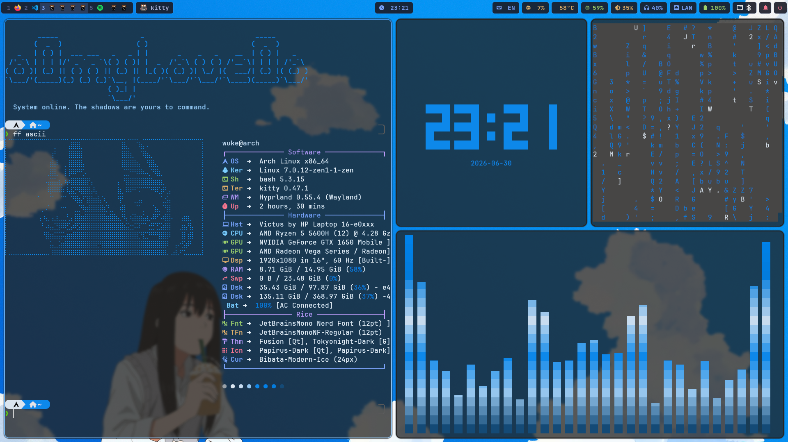
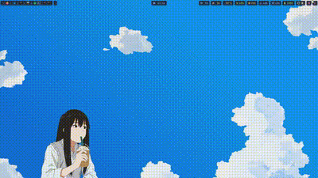

# 🌌 Wuke's Arch Linux Dotfiles


Personal dotfiles for an Arch Linux + Hyprland workspace, built for efficiency, minimalism, and a Tokyo Night aesthetic — with an optional fully dynamic theming mode powered by [Wallust](https://codeberg.org/explosion-mental/wallust).



## 🔔 SwayNC Control Center



## ⚡ Core Components

| Category        | Tool                                      |
|------------------|--------------------------------------------|
| OS               | Arch Linux                                  |
| Compositor       | Hyprland (Wayland)                          |
| Terminal         | Kitty                                       |
| Shell            | Zsh + Oh My Zsh + Powerlevel10k             |
| Status bar       | Waybar (modular, floating island style)     |
| Notifications    | SwayNC (control center with toggles)        |
| Launcher         | Rofi                                        |
| File managers    | Yazi (CLI) / Thunar (GUI)                   |
| System monitor   | btop                                        |
| Fetch            | fastfetch                                   |
| Dynamic colors   | Wallust (k-means palette extraction)        |

## 🎨 Theming: Static vs Dynamic

This setup has two color modes, switchable on the fly:

- **`Super + W`** — pick a wallpaper, apply a **fixed Tokyo Night** palette across every app
- **`Super + Shift + W`** — pick a wallpaper, generate a **dynamic palette from the image** via Wallust and apply it to Hyprland, Kitty, Waybar, SwayNC, Cava, btop, and Yazi
- **`Super + R`** — random wallpaper + dynamic palette

The active mode persists across reboots (`~/.cache/wallpaper-mode`), so restarting won't silently revert your last choice.

## 🧠 Repository Structure

```
dotfiles/
├── install.sh          # One-shot installer (packages + stow + permissions)
├── README.md
├── .zshrc
├── .p10k.zsh
├── .config/
│   ├── hypr/            # Hyprland, hyprlock, hypridle (modular .conf files)
│   ├── waybar/           # Modular bar config (left/center/right + style)
│   ├── rofi/              # Launcher + powermenu (Adi1090x base, trimmed)
│   ├── swaync/            # Notification center + control toggles
│   ├── wallust/           # Templates (dynamic) + static (fixed) color sets
│   ├── kitty/
│   ├── cava/
│   ├── btop/
│   ├── fastfetch/
│   └── yazi/
└── .local/bin/            # Custom scripts (wallpaper manager, night mode, etc.)
```

## 🛠️ Installation

Requires [GNU Stow](https://www.gnu.org/software/stow/).

```bash
git clone git@github.com:oOmyLoveOo/Arch-Hyprland-Dotfiles.git ~/dotfiles
cd ~/dotfiles
./install.sh
```

`install.sh` will:
1. Install required pacman/AUR packages
2. Set up Oh My Zsh, Powerlevel10k, and zsh-autosuggestions
3. Symlink everything into `$HOME` via `stow`
4. Make all scripts executable
5. Apply the default Tokyo Night color scheme

> ⚠️ **Note:** `install.sh` lists the packages this setup is known to need, but the list may drift over time. Review it before running on a fresh machine, especially the AUR package list.

### Manual / partial install

If you only want specific configs without running the full script:

```bash
cd ~/dotfiles
stow --target="$HOME" .
```

Stow only touches files that exist inside this repo — your other `~/.config` folders (browsers, Discord, etc.) are left untouched. `install.sh`, `readme.md`, and `.git` are excluded from stow via `.stow-local-ignore`, so they never get symlinked into `$HOME`.

## ⌨️ Key Bindings (highlights)

| Keybind                  | Action                              |
|---------------------------|--------------------------------------|
| `Super + T`               | Open terminal                       |
| `Super + A`                | App launcher (Rofi)                 |
| `Super + E`                | File manager                        |
| `Super + M`                | Power menu                          |
| `Super + N`                | Toggle night mode                   |
| `Super + W`                | Static Tokyo Night wallpaper picker |
| `Super + Shift + W`        | Dynamic wallpaper picker            |
| `Super + R`                 | Random dynamic wallpaper            |
| `Super + Shift + S`         | Screenshot (region)                 |

See [`.config/hypr/conf/keybinds.conf`](.config/hypr/conf/keybinds.conf) for the full list.

## ✨ Extras

A few terminal toys that show up in the preview above, themed to match Tokyo Night:

- `ff` / `ff ascii` / `ff img` — randomized fastfetch with ASCII art or kitty-graphics images
- `matrix` — cmatrix on a true-black background, independent of kitty's transparency
- `cava` — audio spectrum visualizer
- `tty-clock` — big terminal clock

## 🙏 Credits

- Rofi launcher/powermenu base styles from [Adi1090x's rofi-collection](https://github.com/adi1090x/rofi)
- Color palette: [Tokyo Night](https://github.com/folke/tokyonight.nvim)
- Inspirations: [ErfanRasti](https://github.com/ErfanRasti/dotfiles) & [mkhmtolzhas](https://github.com/mkhmtolzhas/mkhmtdots)

## 📄 License

[MIT](LICENSE) — use whatever you find useful.
